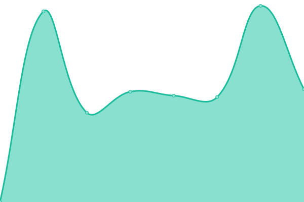

# [📈 Live Status](https://idrunk65.github.io): <!--live status--> **Tous les systèmes sont opérationnels**

This repository contains the open-source uptime monitor and status page for [iDrunK](https://idrunk65.github.io), powered by [Upptime](https://github.com/upptime/upptime).

With [Upptime](https://upptime.js.org), you can get your own unlimited and free uptime monitor and status page, powered entirely by a GitHub repository. We use [Issues](https://github.com/idrunk65/upptime/issues) as incident reports, [Actions](https://github.com/idrunk65/upptime/actions) as uptime monitors, and [Pages](https://idrunk65.github.io) for the status page.

<!--start: status pages-->
<!-- This summary is generated by Upptime (https://github.com/upptime/upptime) -->
<!-- Do not edit this manually, your changes will be overwritten -->
<!-- prettier-ignore -->
| URL | Status | History | Response Time | Uptime |
| --- | ------ | ------- | ------------- | ------ |
|  [Uranium Community](https://uraniumcommunity.com) | En ligne | [uranium-community.yml](https://github.com/iDrunK65/upptime/commits/HEAD/history/uranium-community.yml) | 

 577ms
     
 | 

<a href="https://idrunk65.github.io/upptime/history/uranium-community">100.00%</a>
    

|  [Uranium Community - Forum](https://forum.uraniumcommunity.com) | En ligne | [uranium-community-forum.yml](https://github.com/iDrunK65/upptime/commits/HEAD/history/uranium-community-forum.yml) | 

 616ms
     
 | 

<a href="https://idrunk65.github.io/upptime/history/uranium-community-forum">99.33%</a>
    

|  [Uranium Community - Boutique](https://boutique.uraniumcommunity.com) | En ligne | [uranium-community-boutique.yml](https://github.com/iDrunK65/upptime/commits/HEAD/history/uranium-community-boutique.yml) | 

 1084ms
     
 | 

<a href="https://idrunk65.github.io/upptime/history/uranium-community-boutique">99.33%</a>
    

<!--end: status pages-->

[**Visit our status website →**](https://idrunk65.github.io)

## 📄 License

- Powered by: [Upptime](https://github.com/upptime/upptime)
- Code: [MIT](./LICENSE) © [iDrunK](https://idrunk65.github.io)
- Data in the `./history` directory: [Open Database License](https://opendatacommons.org/licenses/odbl/1-0/)
